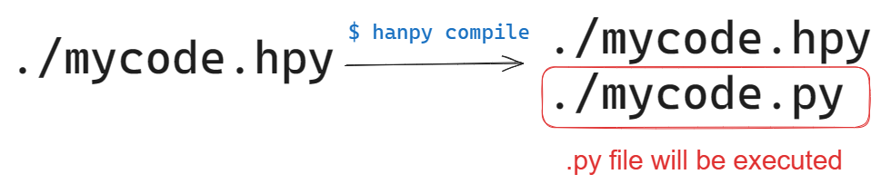

# 명세

## 예상 독자

이 문서는 파이썬에 대해 충분히 알고 있다는 가정 하에 작성되었습니다.

<!-- 튜토리얼은 아직 제작 중입니다. -->

## 전체적 구조

### 파일

한파이는 파일명으로 `.hpy`를 사용합니다.

이 파일에는 `파일 시작 선언`으로 되어 있는 한파이 코드가 담겨 있어야 하고,
이 파일은 동일 디렉토리에 같은 파일명의 `.py` 파일로 컴파일되어 나타납니다.

그리고 그렇게 컴파일이 된 `.py` 파일이 사용됨으로써 여러 잠재적 호환성 문제를 해결합니다.



### 파이썬과의 트렌스파일 가능성

한파이 코드는 모든 상황헤서 파이썬 코드로 트렌스파일될 수 있습니다.

또한 사실상 모든 파이썬 코드는 무조건 한파이 코드로 트렌스파일될 수 있습니다.

단, 파이썬 코드가 한파이의 키워드를 포함하는 경우 트렌스파일을 방해할 수 있습니다.

하지만 그런 코드일지라도 아래에서 설명할 `호환` 모드에서는 항상 한파이로 트렌스파일될 수 있습니다.

## 파일 시작

모든 한파이 코드는 다음과 같은 선언으로 시작해야 합니다.

```hanpy
# 한파이 1
```

인코딩을 명명하고 싶을 경우 다음과 같이 적습니다.

인코딩 명칭 목록은 [이곳](https://docs.python.org/3.11/library/codecs.html#standard-encodings)을 참고하세요.

```hanpy
# utf-8 한파이 1
```

단, 한파이는 기본적으로 utf-8로 인코딩되기 때문에, 만약 이미 한파이 프로그램이 utf-8으로 인코딩되어 있다면 굳이 인코딩을 명시하지 마세요.

한파이에는 `쉬움(쉽고)` 모드와 `호환되는(호환되고)` 모드가 있습니다.
모드를 적용하고 싶은 경우 모드 이름, 혹은 그의 별칭을 `한파이` 앞에 추가하면 됩니다.

```hanpy
# 쉬운 한파이 1
```

```hanpy
# utf-8 쉬운 한파이 1
```

```hanpy
# 쉽고 호환되는 한파이 1
```

```hanpy
# utf-8 호환되고 쉬운 한파이 1
```

### 모드에 대한 설명

#### `호환` 모드

`호환` 모드는 파이썬과의 상호변환성을 완벽하게 지원하기 위해 사용될 수 있는 모드입니다.

`호환` 모드에서는 `에서`를 붙여 사용하는 것이 금지되고, 변수명이 `에서`로 끝날 수 있습니다.

또한 `__시작__`, `__생성__` 등의 dunder가 더 이상 컴파일 시 `__init__`이나 `__new__`로 변환되지 않습니다.

#### `쉬움` 모드

현재 `쉬움` 모드는 별도의 기능이 없습니다. 기본 한파이도 어려운 학습자들을 위해 파이썬의 일부 기능을 단순화해서 사용할 수 있도록 할 계획입니다.

## 키워드

다음과 같은 이름은 키워드입니다.

```
에서
~에서 (호환 모드가 아닌 경우)
대기
포함
미포함
동일
아님
그리고
또는
만약
면
이면
아니면
함수
확인
통과
삭제
반환
제공
올리기
중단
계속
불러오기
전역
비지역
만약
아니고
동안
반복
시도
발생하면
저장하며
포함하면
사용하며
사용해
비동기
클래스
반복해
참
거짓
없음
__디버그__
```

다음은 현재 사용되지는 않지만 미래의 사용을 위해 예약된 키워드들입니다.

```
아니거나
```

이 외에도 파이썬의 키워드를 모두 포함합니다. 한파이에서 파이썬의 키워드를 사용하면 조건 없이 오류를 내보냅니다.

## 에서

함수명, 변수, 속성명 등은 `에서`로 끝날 수 없습니다. `호환` 모드에서는 포함되지 않습니다.

## 일관성 규칙

동사는 한자 도는 한국어로 번역될 수 있습니다.
한자로 번역되는 경우 한자를 그대로 사용하지만(예: 반환),
한국어로 번역되는 경우 `-기`를 붙여 사용합니다(예: 올리기).

## 연산자

### 대기

`await`의 별칭은 `대기`입니다. 단, 대상이 왼쪽에 붙습니다.

```hanpy
asyncio 불러오기

비동기 함수 내_함수():
    asyncio.sleep(1) 대기
```

### 포함 연산자

`in`과 `not in`의 별칭은 각각 `포함`과 `미포함`입니다.

```hanpy
만약 1 포함 range(10):
    출력("포함합니다!")

만약 100 미포함 range(10):
    출력("포함하지 않습니다!")
```

### 객체 동일성 확인 연산자

`is`의 별칭은 `동일`입니다. `is not`은 별칭이 따로 없습니다.

```hanpy
만약 1 동일 1:
    출력("완전히 동일한 객체입니다!")

만약 1 동일 2 아님:
    출력("완전히 동일한 객체는 아닙니다!")
```

### 논리 연산자

`not`의 별칭은 `아님`이지만, 피연산자가 왼쪽에 붙습니다.

```hanpy
만약 거짓 아님:
    출력("거짓이 아닙니다!")
```

`and`의 별칭은 `그리고`입니다.

```hanpy
만약 1 + 1 == 2 그리고 1 - 1 == 0:
    출력("1과 1을 더하면 2고 빼면 0입니다!")
```

<!-- `A 아님 그리고 B`는 `A 아니고 B`로 축약하여 사용할 수 있습니다.

```hanpy
만약 거짓 아니고 참:
    출력("거짓이 아니면서 참입니다!")
``` -->

`or`의 별칭은 `또는`입니다.

```hanpy
만약 참 또는 거짓:
    출력("참 또는 거짓은 참입니다!")
```

<!-- `A 아니고 또는 B`는 `A 아니거나 B`로 축약할 수 있습니다.

```hanpy
만약 1 + 1 == 1 아니거나 1 * 1 == 1:
    출력("1 더하기 1은 3이 아니지만 1 곱하기 1은 1입니다!")
``` -->

### 삼항 연산자

`A if B else C`의 별칭은 `만약 B [이]면 A 아니면 B`입니다.

```hanpy
정수값 = 1
정수값 = 만약 정수값 < 2 [이]면 정수값 + 2 아니면 정수값 - 2
출력(만약 인스턴스확인(정수값, 부동수) [이]면 반올림(정수값) 아니면 정수값)
```

### 람다 함수

`lambda`의 별칭은 `함수`입니다.

```hanpy
내_람다 = 함수 인자: 인자 + 1
```

## 간단한 선언들

### 확인

`assert`의 별칭은 `확인`입니다

```hanpy
1 == 1 확인
1 == 1 확인 "1은 1이어야 합니다."
```

### 통과

`pass`의 별칭은 `통과`입니다.

```hanpy
함수 f(): 통과
```

### 삭제

`del`의 별칭은 `삭제`입니다. 단, 대상이 왼쪽에 붙습니다.

```hanpy
내_변수 삭제
```

### 반환

`return`의 별칭은 `반환`입니다. 단, 대상이 왼쪽에 붙습니다.

```hanpy
1234 반환
```

### 제공

`yield`의 별칭은 `제공`입니다. 단, 대상이 왼쪽에 붙습니다.

```hanpy
1234 제공
```

### 올리기

`raise`의 별칭은 `올리기`입니다. 단, 대상이 왼쪽에 붙습니다.

`raise A from B`의 별칭은 `B 에서 A 올리기`입니다.

```hanpy
ValueError 올리기
None 에서 ValueError 올리기
None에서 ValueError 올리기  # `에서`를 붙여도 작동합니다.
```

### 제어 선언들

`break`의 별칭은 `중단`입니다.

`continue`의 별칭은 `계속`입니다.

```hanpy
범위(10)에서 i 반복:
    만약 i ** 3 > 300:
        중단
    만약 i % 2 == 0:
        계속
```

### 불러오기

`import`의 별칭은 `불러오기`입니다. 단, 대상이 왼쪽에 붙습니다.
`from A import B`의 별칭은 `A에서 B 불러오기`입니다.

```hanpy
math 에서 abs 불러오기
math에서 abs 불러오기  # 에서를 붙여도 작동합니다.
math 불러오기
```

### `__future__`

`__future__`를 사용할 때는 `불러오기`와 같은 방식으로 사용하면 됩니다.

```hanpy
__future__에서 annotations 불러오기
```

### 스코프 선언

`global`의 별칭은 `전역`입니다.

`nonlocal`의 별칭은 `비지역`입니다.

```hanpy
전역변수 = 2
함수 외함수():
    전역 전역변수
    전역변수 = 3
    외함수_변수 = 0
`   
    함수 내함수():
        비지역 외함수_변수
        외함수_변수 = 5

    출력("외함수 변수:", 외함수_변수)  # 출력: `외함수 변수: 0`
    내함수()
    출력("외함수 변수:", 외함수_변수)  # 출력: `외함수 변수: 5`

출력("전역변수:", 전역변수)  # 출력: `전역변수: 2`
외함수()
출력("전역변수:", 전역변수)  # 출력: `전역변수: 3`
```

## 복함 선언들

### 조건문

`if, elif, else`는 다음과 같이 표현됩니다.

```hanpy
만약 1 == 2:
    ...
아니고 1 == 3:
    ...
아니고  1 == 4:
    ...
아니면:
    ...
```

### 반복문

`while`문은 다음과 같이 표현됩니다.

```hanpy
i = 1
i <= 10 동안:
    i += 1
아니면:
    ...
```

`for`문은 다음과 같이 표현됩니다.

```hanpy
범위(10)에서 i 반복:
    만약 i ** 3 > 300:
        끊기
    만약 i % 2 == 0:
        계속
아니면:
    ...
```

### 예외 처리문

`try, except, finally`는 다음과 같이 표현됩니다.

```hanpy
시도:
    ...
ValueError 발생하면:
    ...
ValueError 발생하면 exc에서 저장하며:
    ...
ValueError 포함하면 발생하면:  # except* Exception
    ...
ValueError 포함하면 발생하면 exc에서 저장하며:
    ...
결국:
    ...
```

### 자원 사용문

`with`은 다음과 같이 표현됩니다.

```hanpy
open() 사용하며:
    ...

open() 사용해 var에서 저장하며:
    ...
```

## 함수 선언

```hanpy
함수 실행하기(코드):
    123 반환

비동기 함수 실행하기(코드):
    123 제공
    123 반환
```

## 클래스 선언

```hanpy
클래스 내_클래스(부모):
    함수 __init__(자신):
        자신.속성 = 2

    함수 __시작__(자신):  # 컴파일 시 __init__으로 변경됨
        자신.속성 = 2

    함수 __생성__(클라스):  # 컴파일 시 __new__로 변경됨
        반환 클라스()
```

## 컴프리핸션

```hanpy
(A for B in C if D)
(D 이면 C에서 B 반복해 A)

{K: V for B in C if D}
[D 이면 C에서 B 반복해 K: V]

[A for B in C if D]
[D 이면 C에서 B 반복해 A]

{A for B in C if D}
{D 이면 C에서 B 반복해 A}
```

예시:

```hanpy
[range(10)에서 i 반복해 i ** 2]
[i % 2 == 0 이면 range(10)에서 i 반복해 i ** 2]
```

## `한` 패키지

`한` 패키지는 파이썬의 상수나 함수들에 대한 한글 별칭을 모아놓은 라이브러리입니다.

한파이를 사용하면 기본적으로 불러와집니다.

각각의 파이썬 상수에 대한 별칭은 다음과 같습니다.

```
True           참
False          거짓
None           없음
NotImplemented 미구현
Ellipsis       말줄임표
__debug__      __디버그__
```

함수에 대한 별칭은 다음과 같습니다.

```
A
abs()   절댓값()
aiter() 비동기반복()
all()   모두()
anext() 비동기다음()
any()   아무()
ascii() X

B
bin()        이진수()
bool()       논리값()
breakpoint() 중단점()
bytearray()  이진배열()
bytes()      이진()

C
callable()    호출가능()
chr()         문자로()
classmethod() 클래스메서드()
compile()     파이썬컴파일()
complex()     복소수()

D
delattr() 속성삭제()
dict()    사전()
dir()     이름들()
divmod()  몫나머지()

E
enumerate() 열거()
eval()      파이썬평가()
exec()      파이썬실행()

F
filter()    X
float()     부동수()
format()    X
frozenset() 불변집합()

G
getattr() 속성갖기()
globals() 전역변수()

H
hasattr() 속성가짐()
hash()    해시()
help()    도움말()
hex()     십육진수()

I
id()         메모리위치()
input()      입력()
int()        정수()
isinstance() 인스턴스확인()
issubclass() 자식클래스확인()
iter()       반복()

L
len()    길이()
list()   리스트()
locals() 지역변수()

M
map()        대응()
max()        최대()
memoryview() X
min()        최소()

N
next() 다음()

O
object() 객체()
oct()    팔진법()
open()   파일열기()
ord()    문자순서()

P
pow()      X (`**` 연산자 대신 사용)
print()    출력()
property() 속성()

R
range()    범위()
repr()     표현()
reversed() 반전()
round()    반올림()

S
set()          집합()
setattr()      속성설정()
slice()        X
sorted()       정렬하기()
staticmethod() 정적메서드()
str()          문자열()
sum()          합계()
super()        메소드상속()

T
tuple() 튜플()
type()  타입()

V
vars() 변수확인()

Z
zip() 모둠()

_
__import__() X
```

또한 다음과 같은 함수들이 포함됩니다.

```hanpy
hanpycompile() 컴파일()
hanpyeval()    평가()
hanpyexec()    실행()
```
